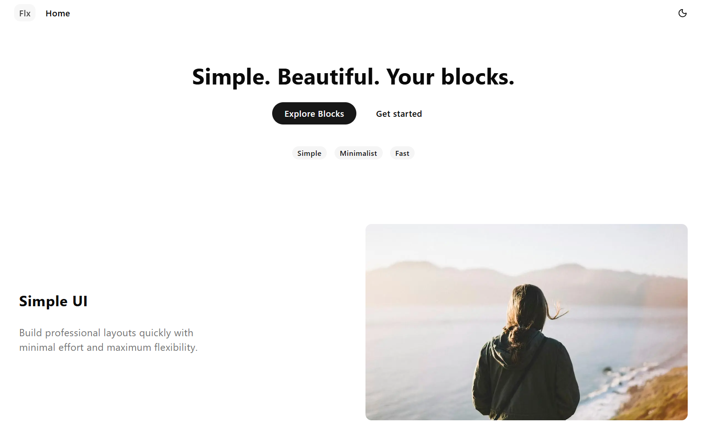

# Flx – Usage example

This repo is a **usage example** of [Flx](https://ui.flexnative.com) UI blocks: Next.js and Sanity wired together, ready to clone, customize, and extend. Blocks are built on [shadcn/ui](https://ui.shadcn.com).



## Documentation and reference

For full documentation, block reference, and examples, go to **[ui.flexnative.com](https://ui.flexnative.com)**.

For detailed setup, project structure, and TypeScript type generation, see the **[Setup guide](docs/SETUP.md)** (optional — only if you want the full picture).

## How to run this example

The project has two parts: the Next.js app (`web`) and Sanity Studio (`sanity`). Each has its own environment variables.

### 1. Sanity (CMS)

```bash
cd sanity
npm install
cp .env.example .env.local
npm run dev
```

Studio runs at [http://localhost:3333](http://localhost:3333). Create a project at [sanity.io/manage](https://www.sanity.io/manage) if you don’t have one yet.

### 2. Environment variables

**Sanity** (`sanity/`) and **web** (`web/`) each have a `.env.example`. Copy it to `.env.local` in the same folder and fill the values according to **your Sanity account** (project ID, dataset, etc.). Use [Sanity Manage](https://www.sanity.io/manage) to get your project ID and create or pick a dataset.

Project ID and dataset must match in both apps. **The project and dataset you set in `sanity/.env.local` are exactly where the dataset import command will write to** when you run `npm run import:dataset` in the `sanity` folder.

### 3. Next.js app

```bash
cd web
npm install
cp .env.example .env.local
# Edit .env.local with your Sanity project ID and dataset
npm run dev
```

The app runs at [http://localhost:3000](http://localhost:3000).

### 4. Run with pre-filled content (recommended for first run)

To see the example with content already in place, import the sample dataset into a **new** Sanity project. This repo includes an export file (`sanity/export.tar.gz`) and npm scripts:

1. In [Sanity Manage](https://www.sanity.io/manage), create a new project (or use a new dataset).
2. In `sanity/`, set `.env.local` with that project’s ID and dataset name. **The import command writes to the project and dataset defined in that file** — so point it to the project you want to fill.
3. From the `sanity/` folder, run:
   ```bash
   npm run import:dataset
   ```
   This imports the sample content into the project/dataset from your env. Then run the Next.js app with the same project ID and dataset in `web/.env.local`.

We recommend using a new project (or a new dataset) so you don’t overwrite existing content. To regenerate the export file from your own content, run `npm run export:dataset` in `sanity/`.

### TypeScript types (Sanity)

After changing schemas in Sanity, regenerate types:

```bash
cd web
npm run typegen
```

## Structure

- **`web/`** – Next.js app that fetches content from Sanity and renders the blocks.
- **`sanity/`** – Sanity Studio with the editable schemas and blocks.

Use this repo as a starting point for your own project or as a reference for integrating Flx with Next.js and Sanity.
